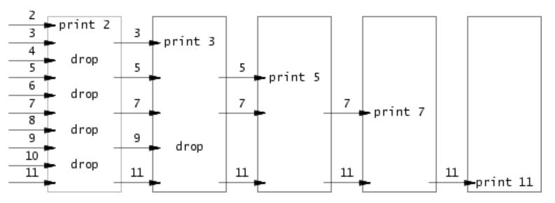

# Lab1 util: Unix utilities
## sleep.c
### require:
利用 sleep
```
$ make qemu
...
init: starting sh
$ sleep 10
(nothing happens for a little while)
$
```
### code:
```c
#include "kernel/types.h"
#include "kernel/stat.h"
#include "user/user.h"

int main(int argc, char *argv[])
{
        if(argc != 2)
        {
                fprintf(2, "Usage: sleep integer...\n");
                exit(1);
        }
        for(int i = 0; i < strlen(argv[1]); i++)
        {
                if(!('0' <= argv[1][i] && argv[1][i] <= '9'))
                {
                        fprintf(2, "Usage: sleep integer...\n");
                        exit(1);
                }
        }
        int time = atoi(argv[1]);
        sleep(time);
        exit(0);
}
```
## pingpong.c
### require:
利用 pipe 和 fork
The parent should send a byte to the child; the child should print "<pid>: received ping", where <pid> is its process ID, write the byte on the pipe to the parent, and exit; the parent should read the byte from the child, print "<pid>: received pong", and exit.
```
$ make qemu
...
init: starting sh
$ pingpong
4: received ping
3: received pong
$
```
### note:
要記得 close no use pipe 和 wait  
### code:
```c
#include "kernel/types.h"
#include "kernel/stat.h"
#include "user/user.h"

int main(int argc, char const *argv[])
{
        if(argc > 1)
        {
                fprintf(2, "Usage: pingpong\n");
                exit(1);
        }
        int pid;
        int p[2];
        pipe(p);
        char buf[2] = "p";

        if(fork() == 0)
        {
                pid = getpid();
                // child read
                if(read(p[0], buf, 1) != 1)
                {
                        fprintf(2, "Error: failed to read in child\n");
                        exit(1);
                }
                close(p[0]);
                fprintf(1, "%d: received ping\n", pid);
                // child write
                if(write(p[1], buf, 1) != 1)
                {
                        fprintf(2, "Error: failed to write in child\n");
                        exit(1);
                }
                close(p[1]);
                exit(0);
        }
        else
        {
                pid = getpid();
                // parent read
                if (write(p[1], buf, 1) != 1)
                {
                        fprintf(2, "Error: failed to write in parent\n");
                        exit(1);
                }
                close(p[1]);
                wait(0); // must wait because parent read after write
                // parent write
                if(read(p[0], buf, 1) != 1)
                {
                        fprintf(2, "Error: failed to read in parent\n");
                        exit(1);
                }
                fprintf(1, "%d: received pong\n", pid);
                close(p[0]);
                exit(0);
        }
}
```
## primes.c
### require:
利用 pipe 和 fork 實現輸出質數到35  
<br />
 
```
$ make qemu
...
init: starting sh
$ primes
prime 2
prime 3
prime 5
prime 7
prime 11
prime 13
prime 17
prime 19
prime 23
prime 29
prime 31
$
```
### note:
要記得 close no use pipe
### code:
```c
#include "kernel/types.h"
#include "kernel/stat.h"
#include "user/user.h"

void newNode(int parent_p[])
{
        if(fork() == 0)
        {
                close(parent_p[1]); // no write from parent_p
                int pline[2];
                pipe(pline);
                int p, n, next = 0, test = 4;
                if(read(parent_p[0], &p, 4) != 4)
                {
                        fprintf(2, "Error: failed to read\n");
                        exit(1);
                }
                fprintf(1, "prime %d\n", p);
                while(test == 4)
                {
                        test = read(parent_p[0], &n, 4);
                        if(test != 4 && test != 0)
                        {
                                fprintf(2, "Error: failed to read\n");
                                exit(1);
                        }
                    if(n % p != 0)
                        {
                                // next for check whether child or not
                                if(next == 0)
                                {
                                        newNode(pline);
                                        next = 1;
                                }
                                if(write(pline[1], &n, 4) != 4)
                                {
                                        fprintf(2, "Error: failed to write %d\n", n);
                                        exit(1);
                                }
                        }
                }
                close(pline[1]);
                wait(0);
                exit(0);
        }
        else
        {
                close(parent_p[0]); // close own read or not close is find
                return;
        }
}

int main(int argc, char *argv[])
{
        if(argc > 1)
        {
                fprintf(2, "Usage: primes\n");
                exit(1);
        }
        // first process
        int pline[2];
        pipe(pline);
        fprintf(1, "prime 2\n");
        int next = 0;
        for(int n = 3; n <= 35; n++)
        {
                if(n % 2 != 0)
                {
                        if(next == 0)
                        {
                                newNode(pline);
                                next = 1;
                        }
                        if(write(pline[1], &n, 4) != 4)
                        {
                                fprintf(2, "Error: failed to write %d\n", n);
                                exit(1);
                        }
                }
        }
        close(pline[1]);
        wait(0);
        exit(0);
}
```
## find.c
### require:
```
$ make qemu
...
init: starting sh
$ echo > b
$ mkdir a
$ echo > a/b
$ find . b
./b
./a/b
$
```
### note:
需要知道 unix 檔案的觀念
### code:
```c
#include "kernel/types.h"
#include "kernel/stat.h"
#include "user/user.h"
#include "kernel/fs.h"

void find(char *path, char *name)
{
        int fd;
        char *p, buf[512];
        struct stat st;
        struct dirent de;
        if((fd = open(path, 0)) < 0)
        {
                fprintf(2, "Error: can't open %s\n", path);
                exit(1);
        }
        if(fstat(fd, &st) < 0)
        {
                fprintf(2, "Error: can't state %s\n", path);
                exit(1);
        }
        switch(st.type)
        {
                case T_FILE:
                        // find filename
                        for(p = path + strlen(path) - 1; p >= path && *p != '/'; p--);
                        p++;
                        if(strcmp(p, name) == 0)
                        {
                                fprintf(1, "%s\n", path);
                        }
                break;
                case T_DIR:
                        // find directory name
                        for(p = path + strlen(path) - 1; p >= path && *p != '/'; p--);
                        p++;
                        if(strcmp(p, name) == 0)
                        {
                                fprintf(1, "%s\n", path);
                        }
                        if(strlen(path) + 1 + DIRSIZ + 1 > sizeof(buf))
                        {
                        printf("Error: path too long\n");
                        break;
                        }
                        /* dirent pointer to files in directory
                           dirent.inum -> inode number
                           dirent.name -> file name*/
                        while(read(fd, &de, sizeof(de)) == sizeof(de))
                        {
                                if(de.inum == 0)
                                        continue;
                                if(strcmp(de.name, ".") != 0 && strcmp(de.name, "..") != 0)
                                {
                                        // update path
                                        strcpy(buf, path);
                                        p = buf + strlen(buf);
                                        *p = '/';
                                        p++;
                                        memmove(p, de.name, DIRSIZ);
                                        p = buf + strlen(buf);
                                        *p = '/';
                                        *(p++) = '\0';
                                        find(buf, name);
                                }
                        }
                break;
        }
        close(fd);
        return;
}


int main(int argc, char *argv[])
{
        if(argc != 3)
        {
                fprintf(2, "Usage: find [path] [pattern]\n");
                exit(1);
        }
        for(int i = 2; i < argc; i++)
                find(argv[1], argv[2]);
        exit(0);
}
```
## xargs.c
### require:
利用 exec
```
$ make qemu
...
init: starting sh
$ sh < xargstest.sh
$ $ $ $ $ $ hello
hello
hello
$ $   
$ echo hello too | xargs echo bye
bye hello too
$
```
### code:
```c
#include "kernel/types.h"
#include "kernel/stat.h"
#include "user/user.h"
#include "kernel/param.h"

void addArgv(char *new_argv[], int *argc)
{
        char buf[512];
        int c = 0;
        while(read(0, buf + c, 1) != 0)
        {
                if(c > 512)
                {
                        fprintf(2, "Error: addition argument too long\n");
                        exit(1);
                }
                // put buf into argv and initalize buf
                if(*(buf + c) == ' ' || *(buf + c) == '\n')
                {
                        *(buf + c) = '\0';
                        (*argc)++;
                        new_argv[*argc - 1] = malloc(sizeof(strlen(buf) + 1));
                        strcpy(new_argv[*argc - 1], buf);
                        memset(buf, '\0', c);
                        c = 0;
                }
                else
                        c++;
        }
        return;
}

int main(int argc, char *argv[])
{
        if(argc <= 1)
        {
                fprintf(2, "Usage: xargs [command]\n");
                exit(1);
        }
        char *new_argv[MAXARG];
        int new_argc = argc - 1;
        for(int i = 1; i < argc; i++)
        {
                new_argv[i - 1] = malloc(sizeof(strlen(argv[i]) + 1));
                strcpy(new_argv[i - 1], argv[i]);
        }
        addArgv(new_argv, &new_argc);
        if(fork() == 0)
        {
                exec(new_argv[0], new_argv);
                fprintf(2, "Error: failed to exec\n");
                exit(1);
        }
        else
        {
                wait(0);
        }
        exit(0);
}
```
## result

