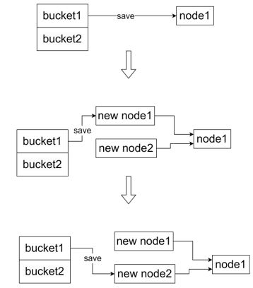

# Lab thread: Multithreading
## Uthread: switching between threads
* Requirement:  
  * design the context switch mechanism for a user-level threading system.  
  * One goal is ensure that when thread_schedule() runs a given thread for the first time, the thread executes the function passed to thread_create(), on its own stack.  
  * Another goal is to ensure that thread_switch saves the registers of the thread being switched away from, restores the registers of the thread being switched to, and returns to the point in the latter thread's instructions where it last left off.   
  
  ```
  $ uthread
  thread_a started
  thread_b started
  thread_c started
  thread_c 0
  thread_a 0
  thread_b 0
  thread_c 1
  thread_a 1
  thread_b 1
  ...
  thread_c 99
  thread_a 99
  thread_b 99
  thread_c: exit after 100
  thread_a: exit after 100
  thread_b: exit after 100
  thread_schedule: no runnable threads
  $
  ```
* Tips:
  * all need to focus on is that need to set ra and sp to let thread start run and run on its own stack
* Step:  
  1. thread.c
     * create strust for data need to save when user thread context switching
       ```c
       struct ucontext
       {
         // callee save register
         uint64 ra;
         uint64 sp;
         uint64 s0;
         uint64 s1;
         uint64 s2;
         uint64 s3;
         uint64 s4;
         uint64 s5;
         uint64 s6;
         uint64 s7;
         uint64 s8;
         uint64 s9;
         uint64 s10;
         uint64 s11;
       };
  
       struct thread {
         char       stack[STACK_SIZE]; /* the thread's stack */
         int        state;             /* FREE, RUNNING, RUNNABLE */
         struct ucontext u_context;
       };
       ```
  2. thread_create() in thread.c
     * set ra to function start and set sp to user stack tail for initalizing user thread
       ```c
       void
       thread_create(void (*func)())
       {
         struct thread *t;
      
         for (t = all_thread; t < all_thread + MAX_THREAD; t++) {
           if (t->state == FREE) break;
         }
         t->state = RUNNABLE;
         // YOUR CODE HERE
         t->u_context.ra = (uint64)func; // save ra then can restore to cpu register
         t->u_context.sp = (uint64)&t->stack[STACK_SIZE - 1];    // save sp then can restore stack to user thread
       }
       ```
  3. thread_schedule() in thread.c
     * schedular need to change context of register to context switching
       ```c
       void
       thread_schedule(void)
       {
         struct thread *t, *next_thread;
         ...
         if (current_thread != next_thread) {         /* switch threads?  */
           next_thread->state = RUNNING;
           t = current_thread;
           current_thread = next_thread;
           /* YOUR CODE HERE
            * Invoke thread_switch to switch from t to next_thread:
            * thread_switch(??, ??);
            */
           // a0: save, a1: load
           thread_switch((uint64)&t->u_context, (uint64)&current_thread->u_context);
          } else
           next_thread = 0;
       }
       ```
  4. uthread_switch.S
     * switch need to save and restore register
       ```asm
       .text
       /*
       * save the old thread's registers,
       * restore the new thread's registers.
       */
       .globl thread_switch
       thread_switch:
          /* YOUR CODE HERE */
          sd ra, 0(a0)
          sd sp, 8(a0)
          sd s0, 16(a0)
          sd s1, 24(a0)
          sd s2, 32(a0)
          sd s3, 40(a0)
          sd s4, 48(a0)
          sd s5, 56(a0)
          sd s6, 64(a0)
          sd s7, 72(a0)
          sd s8, 80(a0)
          sd s9, 88(a0)
          sd s10, 96(a0)
          sd s11, 104(a0)
  
          ld ra, 0(a1)
          ld sp, 8(a1)
          ld s0, 16(a1)
          ld s1, 24(a1)
          ld s2, 32(a1)
          ld s3, 40(a1)
          ld s4, 48(a1)
          ld s5, 56(a1)
          ld s6, 64(a1)
          ld s7, 72(a1)
          ld s8, 80(a1)
          ld s9, 88(a1)
          ld s10, 96(a1)
          ld s11, 104(a1)
          ret    /* return to ra */
       ```
## Using threads
* Requirement
  * parallel programming with threads and locks using a hash table  
  * The argument to ph specifies the number of threads that execute put and get operations on the the hash table.  
  * x keys missing indicate that a large number of keys that should have been in the hash table are not there. That is, the puts were supposed to add those keys to the hash table, but something went wrong in two or more thread  
  * keep some put operations run in parallel while maintaining correctness.
    ```
    $ make ph
    $ ./ph 1
    100000 puts, 3.991 seconds, 25056 puts/second
    0: 0 keys missing
    100000 gets, 3.981 seconds, 25118 gets/second
    $ ./ph 2
    100000 puts, 1.885 seconds, 53044 puts/second
    1: 0 keys missing
    0: 0 keys missing
    200000 gets, 4.322 seconds, 46274 gets/second
    ```
* Tips:
  <br />
   
  ```c
  pthread_mutex_t lock;            // declare a lock
  pthread_mutex_init(&lock, NULL); // initialize the lock
  pthread_mutex_lock(&lock);       // acquire lock
  pthread_mutex_unlock(&lock);     // release lock
  ```
* Step:
  1. ph.c
     create lock for each bucket but not one lock because parallel
     ```c
     pthread_mutex_t lock[NBUCKET];
     ``` 
  2. put(int key, int value) in ph.c
     ```c
     static
     void put(int key, int value)
     {
        int i = key % NBUCKET;

        if(e){
          // update the existing key.
          e->value = value;
        } else {
          // the new is new.
          pthread_mutex_lock(&lock[i]);
          insert(key, value, &table[i], table[i]);
          pthread_mutex_unlock(&lock[i]);
        } 
      }
     ```
## Barrier
* Requirement:
  * barrier: a point in an application at which all participating threads must wait until all other participating threads reach that point too.
    ```
    $ ./barrier 2
    $ OK; passed
    ```
* Tips:
  ```c
  pthread_cond_wait(&cond, &mutex);  // go to sleep on cond, releasing lock mutex, acquiring lock mutex when wake up  
  pthread_cond_broadcast(&cond);     // wake up every thread sleeping on cond
  ```
* Steps:
  1. barrier() in barrier.c
     * when all thread arrive check point, wait up all thread
     ```c
     static void
     barrier()
     {
       // YOUR CODE HERE
       //
       // Block until all threads have called barrier() and
       // then increment bstate.round.
       //
       pthread_mutex_lock(&bstate.barrier_mutex); // when change bstate need lock
       bstate.nthread++;
       if(nthread == bstate.nthread)
       {
         bstate.round++;
         bstate.nthread = 0;
         pthread_cond_broadcast(&bstate.barrier_cond);
       }
       else
         pthread_cond_wait(&bstate.barrier_cond, &bstate.barrier_mutex); // when sleep then release lock, when wake up acquire lock
       pthread_mutex_unlock(&bstate.barrier_mutex);
     }
     ```
